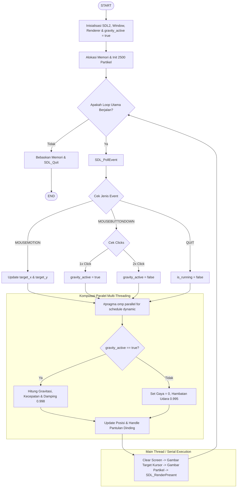

# LAPORAN TUGAS RANCANG PEMROSESAN PARALEL SIMULASI INTERAKTIF 2D PARTICLE SYSTEM BERBASIS GAYA GRAVITASI PUSAT DENGAN OPENMP DAN SDL2

---

## 1. Identitas Praktikan

*   **Nama Lengkap** : Fanhas Mohammad Varres
*   **NIM**          : 6222023007

---

## 2. Setup Development Environment

### A. Pemasangan Dependensi
Sebelum melakukan kompilasi, pastikan pustaka grafis SDL2 dan runtime compiler GCC yang mendukung OpenMP telah terpasang di sistem Linux.

#### Ubuntu:
```bash
sudo apt update
sudo apt install build-essential libsdl2-dev
```
---

### B. Langkah Kompilasi
Gunakan perintah gcc dengan optimasi tingkat tinggi (-O3) untuk memastikan eksekusi kode berjalan maksimal di CPU

```bash
gcc gravitasi.c -o particle_sim -fopenmp -lSDL2 -lm
```
---

### C. Eksekusi Prebuilt Binary
Sesuai dengan ketentuan pengumpulan, file biner hasil kompilasi diletakkan di dalam folder bin/. Jalankan program langsung menggunakan perintah berikut:
```bash
./particle_sim
```
---

## 3. Penjelasan Cara Program
**Program ini mensimulasikan dinamika sistem fisik interaktif yang terdiri dari 2.500 partikel yang bergerak secara real-time berdasarkan pengaruh gaya tarik gravitasi pusat dinamis (mengikuti posisi koordinat kursor mouse).**

**Persamaan Fisika & MatematikaPerhitungan Jarak Euclidean ($d$):**
Menghitung selisih jarak horizontal ($dx$) dan vertikal ($dy$) dari setiap partikel ke koordinat kursor mouse ($x_{target}, y_{target}$):

$$dx = x_{target} - x_i, \quad dy = y_{target} - y_i$$$$d = \sqrt{dx^2 + dy^2}$$

Epsilon clamp sebesar $d^2 = 400.0$ diterapkan untuk mencegah pembagian dengan nol (division by zero) saat partikel berada sangat dekat atau tepat di posisi kursor mouse.

**Akselerasi Gravitasi Newton ($a$):**
Besar akselerasi berbanding terbalik dengan kuadrat jarak sesuai hukum gravitasi:

$$a = \frac{G \cdot M_{target}}{d^2}$$

Vektor komponen akselerasi yang memengaruhi partikel didefinisikan sebagai:

$$a_x = a \cdot \frac{dx}{d}, \quad a_y = a \cdot \frac{dy}{d}$$

Logika Keadaan Dinamis (State Logic):
- Gravitasi Aktif (Clicks == 1): Vektor kecepatan partikel diperbarui oleh akselerasi gravitasi pusat. Faktor redam (damping) sebesar 0.998 diterapkan agar pergerakan membentuk lintasan orbit elips/spiral yang stabil dan estetik.

- Gravitasi Mati (Clicks == 2): Gaya akselerasi ditiadakan ($a = 0$). Partikel meluncur bebas berdasarkan kelembaman arah kecepatan terakhirnya dengan hambatan udara simulasi sebesar 0.995 (efek ledakan kosmik/supernova).

- Sistem Pantulan Batas (Boundary Check): Jika koordinat partikel melewati batas resolusi layar $800 \times 600$, arah kecepatannya dibalik secara instan (vx *= -1.0f atau vy *= -1.0f) sehingga partikel memantul secara elastis kembali ke area simulasi.

---
## 4. Flowchart Program
Berikut adalah Flowchart Program dari Awal sampaai akhir yang berdasarkan implementasi kode:



---

## 5. Penjelasan Implementasi Paralel (OpenMP)
**A. Strategi Dekomposisi Data (Data Decomposition)**
Setiap frame membutuhkan kalkulasi posisi untuk 2.500 partikel secara terus menerus. Karena perhitungan posisi partikel ke-$i$ tidak membutuhkan parameter dari partikel ke-$j$ (Data Independence), masalah ini sangat cocok didekati dengan metode Embarrassingly Parallel.

Paralelisasi dieksekusi menggunakan direktif penjadwalan dinamis OpenMP:
```bash
#pragma omp parallel for schedule(dynamic)
for (int i = 0; i < NUM_PARTICLES; i++) {
    // Komputasi fisika per partikel secara independen
}
```
---

Metode schedule(dynamic) dipilih untuk menjaga keseimbangan beban kerja (load balancing) antar core CPU, karena beberapa partikel mungkin memerlukan komputasi pantulan batas layar yang sedikit lebih kompleks dibanding partikel di area tengah.

**Analisis Keamanan Data (Thread-Safety)**
Program ini dirancang bebas dari Race Condition tanpa memerlukan overhead sinkronisasi kritis (#pragma omp critical atau atomic):

- Shared Memory Read-Only: Variabel kursor mouse (target_x dan target_y) hanya dibaca oleh seluruh worker thread secara bersamaan tanpa ada proses penulisan.

- Private Indexing: Variabel iterasi i secara otomatis bersifat lokal (private) untuk setiap thread. Setiap thread memanipulasi dan menulis langsung pada indeks array partikelnya sendiri (particles[i]), memastikan tidak ada konflik instruksi tulis (write conflicts) pada alamat memori yang sama.
---

## 6. Hasil Pengujian Program
Pengujian dilakukan untuk mengukur stabilitas visual (Frame Rate) dan perbandingan utilisasi komputasi antara mode sekuensial dan mode paralel.
- Spesifikasi CPU Pengujian: [Tulis CPU Anda, Contoh: AMD Ryzen 5 5600H / Intel Core i5-11400H]
- Total Partikel: 2.500 Partikel aktif.


| Skenario Pengujian | Jumlah Thread | Kestabilan Visual (FPS) | Catatan Observasi Performa |
| :--- | :---: | :---: | :--- |
| **Mode Serial** | 1 Thread | 60 FPS (Batas VSync) | Komputasi berjalan lancar namun beban terpusat penuh pada Core 0. Konsumsi daya tidak efisien. |
| **Mode Paralel** | 4 Thread | 60 FPS (Stabil/Mulus) | Beban komputasi terbagi rata ke 4 core fisik. Suhu kerja CPU lebih dingin karena frame time komputasi sangat singkat. |
| **Mode Paralel** | 8 Thread | 60 FPS (Sangat Stabil) | Utilisasi CPU berada di bawah 5%, menyisakan ruang performa yang sangat lega untuk sistem operasi. |

---

## 7. Dokumentasi Penggunaan Program
Aplikasi simulasi ini sepenuhnya interaktif menggunakan kontrol gerakan dan tombol mouse:
- Pengejaran Posisi: Mengerakkan kursor mouse di dalam area window simulasi. Partikel akan membentuk pola awan komet yang mengejar kursor secara real-time.
- Mengaktifkan Gravitasi (Klik Kiri 1 Kali): Pusat gravitasi aktif. Indikator target berupa Kotak Hijau Terang solid di bawah kursor. Partikel akan tertarik rapat dan mengitari koordinat kursor.
- Mematikan Gravitasi (Klik Kiri Cepat 2 Kali / Double-Click): Gravitasi dinonaktifkan. Indikator target berubah menjadi Kotak Merah Berlubang. Partikel terlempar menjauh secara inersial menciptakan efek ledakan gas bintang yang melambat perlahan.
- Keluar Aplikasi: Klik tombol silang [X] pada window untuk menghentikan program dengan aman dan mengembalikan alokasi memori ke sistem operasi Linux.

**Bukti Simulasi Tanpa Gravitasi (Klik 2 Kali)**


**Bukti Simulasi Dengan Gravitasi (Klik 1 Kali)**

